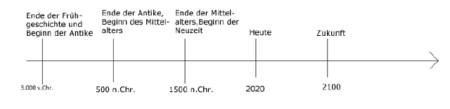

## 1.2. VON ANBEGINN DER ZEIT

Wissen Sie, warum wir in unserer heutigen Zeitrechnung im Jahre 2022 leben?

Ich durfte mit Erschrecken immer wieder miterleben, wie viele Menschen, diese Antwort nicht wissen. Weltweit feiern Menschen jedes Jahr Sylvester (welcher Sinn, sich mir leider noch nicht
entschlossen hat), ohne zu wissen, was erst zum Anbeginn unserer Zeitrechnung geführt hat: Das Jahr 0.

### Zeitstrahl

[@ScioDoo.de](https://sciodoo.de)

Es ist das Jahr, in dem schätzungsweise ein gewisser Herr Jesus Christus geboren wurde. Wer oder was er war, spielt für Sie in diesem Buch weniger eine Rolle. 

Die Erde braucht ein Jahr, um die Sonne einmal komplett zu umrunden. Ja, genau genommen braucht sie: 365 Tage; 5h; 48min; 46sec.

Welches das Schaltjahr alle 4 Jahre erklärt, damit wir
nicht jedes Jahr knapp 6h vom astronomischen
Zeitalter abweichen. 

Der Mensch aber lebt im hier und jetzt, er lebte in der Vergangenheit und er lebt in der Zukunft.

Um es vereinfacht zu sagen: Sie lebten 2021. Sie leben jetzt gerade da, wo sie diese Zeilen lesen und leben noch, wenn dieser Satz in ihrer Wahrnehmung beendet ist. 

Oder Sie leben in Deutschland und Ihr Kind in Australien, aber ihre Frau in Amerika. Wo existieren Sie in der Zeit?

Wichtig für Sie ist, in welchem Zeitraum Sie sich
befinden, dass Sie Zeiträume richtig einschätzen
können und verstehen, dass diese begrenzt und
in ihrer Einzigartigkeit nicht reproduzierbar sind. Jedes
Jahr, jeder Moment ihres Lebens. Nichts ist endlos, nur die Zeit selbst.
