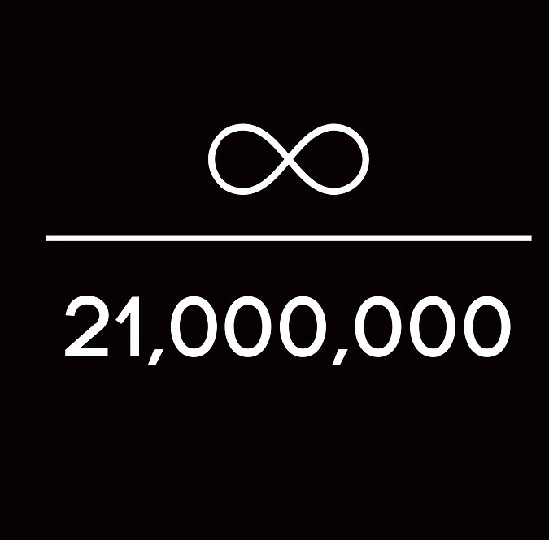

## 1.5. DIE WAHRNEHMUNG UNSERER ZEIT

Wie nimmt der Mensch seine Zeit auf Erden eigentlich wahr? Wann und warum ändert sich diese Wahrnehmung?

Unser Leben ist von Anfang bis Ende mit einer durchschnittlichen Lebenserwartung von 83,4 Jahren für weibliche und 78,6 Jahren für das männliche Geschlecht zu erwarten. In all dieser Zeit, steht Ihnen eine unbekannte X an physikalischer Leistung zu Verfügung. Ebenso können Sie auch nur
eine begrenzte in Eigenleistung erbringen.

Unsere Lebenszeit ist in 5 Phasen unterteilt, die
sogenannten Lebensabschnitte.

Der Begriff Lebensabschnitt bezeichnet jeweils
einer dieser Phasen, der nachgeburtlichen
Entwicklung des Menschen.

- Geburt 0-2
- Kindheit 3-11
- Jugend 12-19
- Erwachsen werde/sein 18-69
- Senioren 70+

Wir nehmen jeder dieser Phasen absolut unterschiedlich war. Unsere komplette Lebensplanung in unserer heutigen zivilisierten
Gesellschaft richtet sich nach ihr. Jede Phase sollte respektiert, genutzt und honoriert werden ,um die Würde des Menschen zu wahren.

Erkennen Sie sich im folgenden Beispielen wieder?

Geburt bis Erwachsen werden:
- leben
- lachen
- lernen
- spielen
- träumen
- sorgenfrei
- Genuss

Vom Erwachsenenalter bis zum Senior:
- "9 to 5" Montag bis Freitag oder Sonntag
- In der Freizeit berauschende Mittel zum Genuss konsumieren
- Aufgehört zu lernen
- frustriert, wütend, beschwerend
- arbeiten, Schulden abzahlen

Vom Senior bis zum Tod:
- müde, erschöpft
- frustriert, wehmütig, nostalgisch
- der Wunsch nach mehr Zeit oder die Zeit zurückdrehen zu können
- Warten auf den Tod

Für mich klingt dies nicht wirklich nach Erfüllung oder der Sinn des Seins.

Zeit lässt sich nicht sparen, nur einsparen. Ihre ist
endlich, sie ist begrenzt und eine unbekannte X, ebenso wie die allen Lebens und die damit einhergehende Leistung physikalischer Arbeit.

Zufall oder Schicksal?

Ihre Vergangenheit ist gewiss!
Ihre Zukunft, eine Annahme!
Ihre Gegenwart, das jetzt!
Zeit ist relativ.

> Wer soll das bezahlen?  
> Wer hat das bestellt? Wer hat soviel  
> Pinkepinke? 
> Wer hat soviel Geld?
> 
> *Lied von Jupp Schmitz* 
> *Wer soll das bezahlen? Refrain von 1949*

