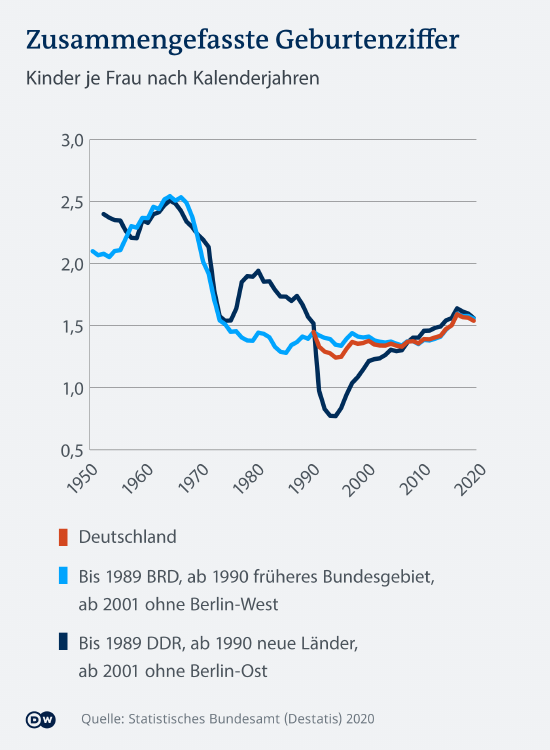
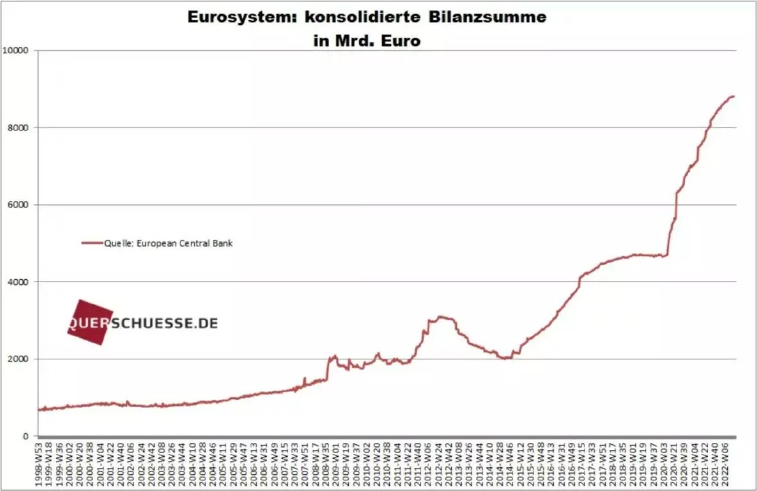

## 1.6. DIE ZUKUNFT ODER DIE GESTOHLENE ZEIT UNSERER KINDER

Wir wissen jetzt was Zeit, was ein Zeitraum und was die
die Phasen  unseres Lebenszyklus sind. Nun kommen wir
zu dem, was wir „Schulden“ nennen.

Schulden haben Sie dann, wenn Sie eine gewisse
Summe X an Medium/ Währung nicht selbst aufbringen können und sich diese von einer 3.Partei „leihen“ bzw. borgen müssen. Sie benutzen also fremdes Kapital, daher der Begriff Fremdkapital.

Schulden können Sie machen als:
- Privatpersonen
- Geschäfte/Unternehmen
- Staat

Folgendes Beispiel:

Ich verkaufe Ihnen dieses Buch, für 1 Stunde ihrer Zeit als Medium der Währung. Ich bevorzuge alles in Stunden (h) vom Arbeitsaufwand umzurechnen. Es zeigt Ihnen am ehesten die Realität. 

In unserem Beispiel haben Sie aber nur 30 min. Zeit. Sie
möchten aber trotzdem dieses Buch. Sie werden sich die Zeit, die sie zusätzlich benötigen, von jemand anders leihen müssen.

Aber Sie sind alleine, was nun? Die Lösung ist einfach: Etwas Magie „heute back ich, morgen brau ich, übermorgen schließen wir eben einen Generationenvertrag" und die fehlenden 30min,
sowie alle deine Zeitschulden werden von deinen Kindern und Kindeskindern bezahlt werden.

Du kannst dich also noch in Ruhe weiter umsehen und Schulden machen, so viele wie du willst. Warum an morgen denken und wenn diese Generation ein Problem damit haben sollte, bekomme ich es ja nicht mit, denn meine Zeit ist um.

Sagen sie mir ehrlich, ist das fair? Können Sie eine solch weitreichende Entscheidung überhaupt treffen? Ist das nicht kriminell?

Wenn Sie der Staat sind, ist es natürlich legitim. Sie nennen es Steuern, welche nichts weiter als Raub sind und sollen, wie das Wort schon sagt, uns steuerbar oder gefügig machen.

Verkauft als Einigkeit, Recht und Freiheit - welche Ironie.

Wir nennen es nur eben “Staatsschulden“. Und jetzt denken Sie bitte an jede Steuerverschwendung, die Ihnen einfällt. Sie ist sehr wahrscheinlich noch nicht abbezahlt. Ihr Kind wird es schon machen, ob es das will oder nicht. Aber wenn das alle machen und die versprochenen Rückzahlungen nicht erfüllt werden, dann bricht alles in sich zusammen wie ein
Kartenhaus.

Kinder haften für ihre Eltern, nicht die Eltern für ihre
Kinder, in der Matrix.

> „Das ist schon bald nicht mehr“.
> 
> *Trinity@Matrix*
