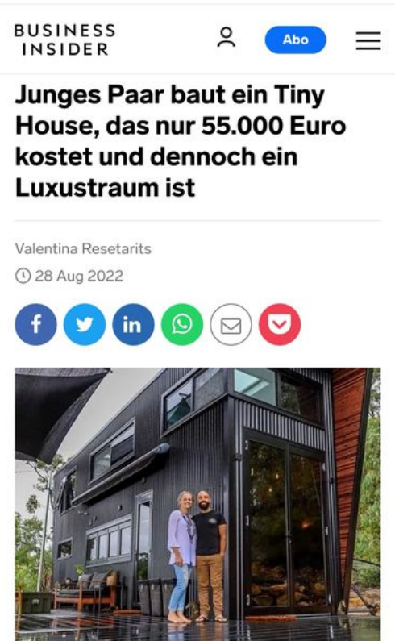

## 1.7 BEISPIEL: FALSCHE ZEIT

 
*Artikel vom 28.08.2022 Business Insider* 
*Autorin: Venentina Resetoris*

Was denken sie zuerst? Es ist handelt sich um die Gegenwart. Die Headline des von mir gewählten Beispiel soll ihnen folgendes suggerieren:

- Ich kann mir noch etwas Luxus leisten, auch wenn Sie sich keine reguläre Immobilie leisten können.
- "baut und nicht baute" - also ist es aktuell.
- "kostet" - wieder die Gegenwart.
- "nur" 55.000€ - es ist nicht viel Geld, was sie dafür erbringen müssen.

Nur die bloße Annahme, dass sie auch 55.000€ bezahlen würden, ist aber falsch. Aber warum ist das so?

Nun ja, Zeiten ändern sich. Ebenso wie die Summe, die wir erbringen müssen, um bestimmte Dinge zu erwerben.

Das erwähnte Tiny House steht in Australien und wurde dort von den Eignern in Eigenleistung erbaut. Matt und Lisa schätzen ihre Kosten inzwischen auf 80-90.000 Australische Dollar.

*Quelle: YouTube   Titel: Ultra Tiny House will Blog up your Mind Datum: 05.04.2019 Kanal: Living Big in a Tiny House*

Nur die kleinste Veränderung der Verhältnisse oder der
Dimensionen kann unseren Verstand täuschen. Achten sie immer auf die Zeit!

Sogar das Foto wurde von der mir aufgeführten ursprünglichen Quelle übernommen.

Die Quellenangabe der Autorin wurde im Artikel bewusst nicht genannt.

Aber warum?

Copy and Paste, erscheint von immer mehr Journalisten und Medien die investigative Arbeit zu ersetzen.

Die einfachsten Dinge falsch ausgeführt, können
ungeahnte Konsequenzen herbeiführen, welche sich
nur für Sie als Individuum, für eine bestimmte
Gruppe oder für alle als Gemeinschaft auswirken.

Sein Sie sich dessen steht’s bewusst, dass Ursache und Wirkung ein essenzieller Teil unseres Lebens sind.

Falsche Erwartungen, das Wecken von unerfüllbaren Träumen, ist nichts anderes als der Raub an unserer Zeit.

Sie merken, die Dinge vermischen sich all zu schnell
und es ist leicht, Dinge so zu mischen , wie ich sie
gerne möchte, dass sie verstanden werde sollen.

Ist ein Bedürfnis erst einmal geweckt worden, will es
in der Regel auch gestillt werden.

Denken sie darüber nach, durch was ihr Konsumverhalten beeinflusst wird, ob Sie in Wirklichkeit nur ein Kompromiss gefunden haben, vom Haus mit Garten zum Bauwagen auf dem
Parkplatz, welch ein Luxus.

Lassen sie sich nicht für dumm verkaufen. Ich frage
Sie, träumen Sie nicht von einem normalen Haus mit
Garten, einer Familie, einer Arbeit die Ihnen den
normalen Mittelstand ermöglicht? Wollen Sie
wirklich minimalistisch leben, oder zwingt Sie dazu
Ihre wirtschaftliche Lage?

> „Willkommen in der Wüste des Realen“
>
> *Morpheus @Matrix*
