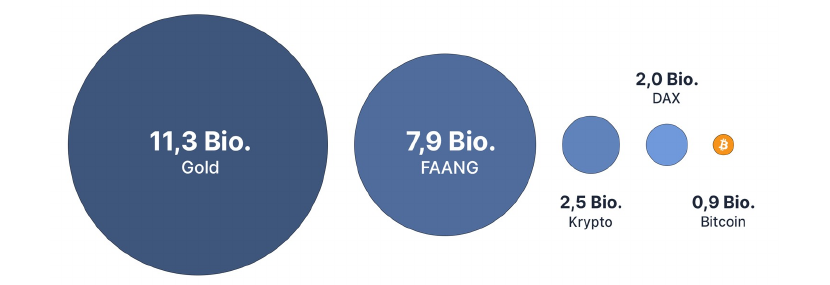

## 3.4. VERMÖGENSWERTE

Was versteht man unter Vermögenswerte beziehungsweise Vermögensklasse?

Als Vermögensklassen werden bezeichnet: Immobilien, Aktien, Rohstoffe wie z.B Bitcoin, Edelmetalle, Fonds, Kunst, Antiquitäten, Oldtimer,
Uhren, Schiffe, Firmenbeteiligungen usw.

Allem, was dem Menschen als nützlich, wichtig oder einzigartig genug erscheint, bekommt einen für sich stehenden Wert, welcher durch das Medium Geld interpretiert wird. Jede einzelne für sich lässt sich als Vermögensklasse bezeichnen und jede ist auch Geld, so können Sie ihr Vermögen nach Belieben diversifizieren.

### Aber:

Vermögen ist eine Illusion, da Sie nicht wissen, wieviel Zeit Ihnen noch bleibt oder wieviel Zeit der jeweiligen Vermögensklasse.

Sie können mit nichts Zeit kaufen. Vermögen, Wohlstand und Reichtum ermöglicht uns nur ein möglichst komfortables Leben. Materielle Dinge sind also jeweils nach ihrem „Stock to Flow“ Zeitanlagen und keine Wertanlagen.

Ihr Reichtum an materiellen Dingen kann durch Regierungen konfisziert, durch die Allgemeinheit/Gesellschaft entwertet oder überwertet werden.

Die bloße Annahme, dass Sie selbst alleine maßgeblich Einfluss auf Ihren Reichtum haben, kann also nur zum Teil zugestimmt werden. Denn es ist die Gesellschaft, die Entscheidung eines jeden Einzelnen und Sie sind ein Teil davon.

So wie Bitcoin, es bekommt sein Wert durch Sie zugeschrieben, nur dass es nicht konfisziert werden kann. Der Bitcoin verlässt nie sein Netzwerk bzw. die Timechain über die physische Welt.

Was Ihre Zugangsdaten und Ihre Verifizierung angeht, ist es wie bei allen Dingen. Lassen Sie Pin und
Karte offen neben den Automaten liegen, kann sich jeder von Ihrem Konto bedienen. Ähnlich wäre der Zugriff die **UTXO** möglich.

> Wie viel Geld gibt es auf der Welt? 
> Was ist was wirklich Wert? 
> Wie viel Physikalische Leistung ist maximal vorhanden? 
> Warum ist alles durch 21 teilbar? 
> Und was zur Hölle ist UTXO? 

 
*Anlageklassen nach Marktkapitalisierung in US-Dollar (2021) 
Quellen: Morningstar, Finanzen.net, savlillis.com, CoinMarketcap  
Via [blockchainwelt.de](https://blockchainwelt.de/)*

