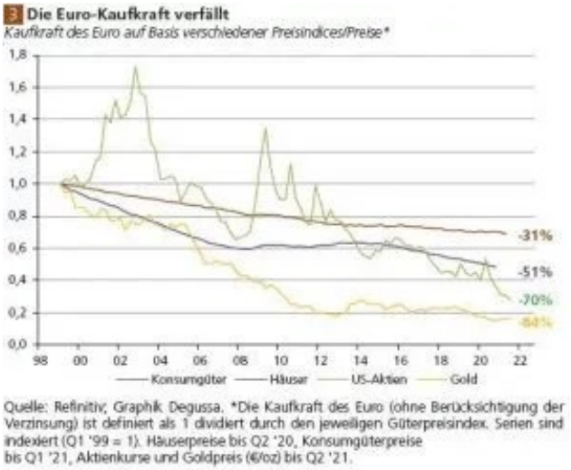
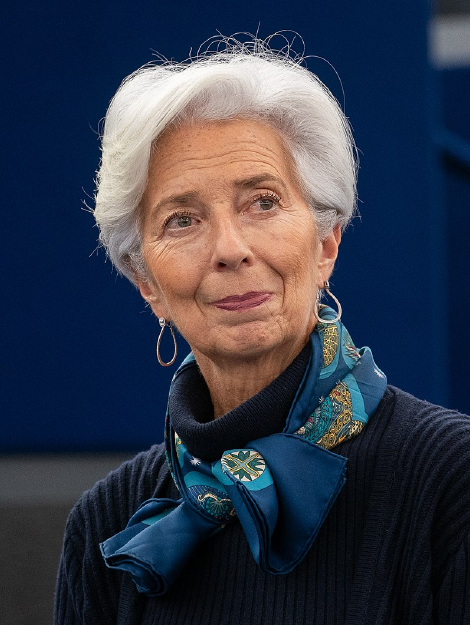
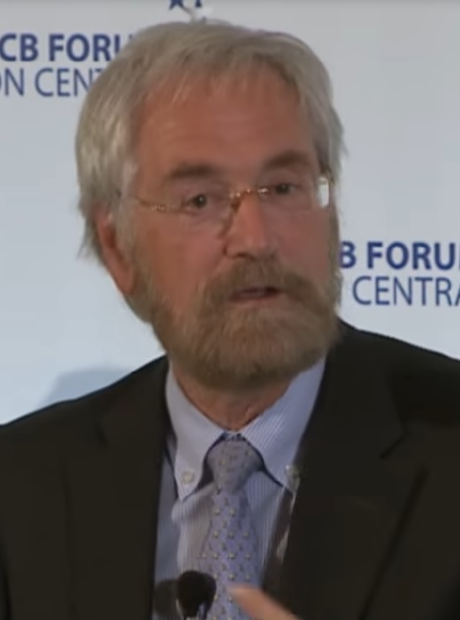

## 3.8. DIE EZB

Gangster im Anzug.

*Die Arbeit und die Aufgaben der EZB wurden erstmals im Vertrag von Maastricht 1992 festgelegt. Seit dem Vertrag von Lissabon 2007 besitzt sie formal den Status eines EU-Organs. Die wichtigste Bestimmungen zu ihrer Funktionsweise finnden sich im Art.282 .AEU-
Vertrag, ihre Satzung ist in dem Vertrag als Protokoll Nr.4 angehängt.*

*Im November 2014 wurde die EZB zusätzlich mit der Aufsicht systemrelevanter Bankenaufsichtsmechanismus (SSM) betraut. Die EZB ist eine supranationale Institution mit eigener Rechtspersönlichkeit.*

Quelle: [@Wikipedia](https://de.wikipedia.org/wiki/Europ%C3%A4ische_Zentralbank)

Die Aufgaben und Ziele einer solchen Bank sollten eigentlich "Preisniveaustabilität" sein.

Gut schauen wir zurück, zur Einführung des Euros bis heute ...

[Finanzen100](https://www.finanzen100.de/finanznachrichten/boerse/ob-kontrolliert-oder-explosiv-an-einer-geldentwertung-fuehrt-kein-weg-vorbei_H578273647_1247295/)

Was für ein stabiler Abwärtstrend der Kaufkraft.

Die Gesetze und Verträge? Nun, nur Schrift und Wort, ich ändere die Welt, so wie Sie mir gefällt.

Sie glauben mir nicht? Warum ist dann ständig Krise und warum wird alles immer teurer, wieso fragt man nicht mehr, was etwas
kostet, sondern nur noch wie teuer ist das?

Gesetze, Regeln werden von Menschen für Menschen gemacht, ob man sich daran hält, ist freiwillig, solange einem die Konsequenzen bewusst sind. Aber wie würden Sie es finden, wenn für Sie ganz andere Gesetze gelten als zum Beispiel für Christin Lagarde?

Schuldspruch 19.12.2016
Steuerbetrug 400.000.000€

Sie wurde nicht bestraft, Sie kam davon und wurde sogar noch befördert, vom IWF zur EZB Chefin.

Zum Vergleich: Uli Hoeneß bekam für 28,5 Millionen Euro dreieinhalb Jahre, welche er auch nach und nach entfliehen konnte, dank seiner Macht und dem Vermögen, welches dahinter steckt.

Georg Thiel hat 1827€ GEZ Steuer nicht bezahlt und erhielt 181 Tage Gefängnis.

Es ist zum Verzweifeln wie Korruption ganzen offen nicht bestraft wird und jetzt im großen Still zur Planwirtschaft und Öko-Diktatur ausartet. Etatisten.

> "What ever it takes".
> 
> *Mario Draghi auf die Frage, was die EZB in einer Krise tun würde.*

Klingt das für sich vertrauenswürdig? Für mich klingt das nach einem Ponzi-Betrugssystem, das als Monopol staatlich geschützt ist, das ihre Zeit klaut und Sie sind dagegen machtlos.

Die bestimmen über alles, zur Not per Gesetze. Es dient nicht uns, nur sich selbst und deren, die davon profitieren, welche nur ein Bruchteil sind, im Vergleich zur Gesellschaft, die ihr gegenüber steht.

Sie denkt nicht an morgen, weil sie genug mit dem heute zu kämpfen haben.

Und bevor Sie Ihre Macht verlieren, kommt ein letztes großes Gefecht, ein letztes aufräumen des Feindes mit einer CDBC. Eine zu 100% nur rein digitaler, zentraler Euro unter der Kontrolle einiger weniger und ihrer Utopie vom grünen Sozialismus.

Kein freies Geld bedeutet kein freies leben, kein freier Markt. Welcome to China.

Manche Länder zahlen mehr ein als andere. Das bedeutet aber nicht, das sie bei den Entscheidungen der EZB ein größeres
Mitspracherecht haben. Je größer ein Land, dessen Population und Wirtschaft/BIP, desto höher auch sein Betrag an
Anteilen und Haltung der EZB.

Alle Euro-Länder sind im EZB-Rat vertreten und können sich bei seinen Sitzungen zu Wort melden. Die Stimmrechte rotieren im EZB-Rat und werden mittels eines speziellen Systems zugewiesen.

| Land         | Prozentanteil |
|--------------|---------------|
| Deutschland  | 21,4394 %     |
| Frankreich   | 16,6108 %     |
| Italien      | 13,8165 %     |
| Spanien      | 9,6981 %      |
| Niederlande  | 4,7662 %      |
| Belgien      | 2,9630 %      |
| Österreich   | 2,3804 %      |
| Griechenland | 2,0117 %      |
| Portugal     | 1,9035 %      |
| Finnland     | 1,4939 %      |
| Irland       | 1,3772 %      |
| Kroatien     | 0,6595 %      |
| Litauen      | 0,4707 %      |
| Slowakei     | 0,3916 %      |
| Lettland     | 0,3169 %      |
| Luxemburg    | 0,2679 %      |
| Estland      | 0,2291 %      |
| Zypern       | 0,1750 %      |
| Malta        | 0,0853 %      |

**Insgesamt 81,9881 %[^note]**

[^note]: Etwaige Differenzen in der Summe durch Runden der Zahlen.

[EZB](https://www.ecb.europa.eu/ecb/orga/capital/html/index.de.html)

Daten der Europäischen Kommission bilden die Grundlage für die Anpassungen. Die letzte Anpassungen wurden am 01.02.2020 vorgenommen, nach dem Brexit sowie am 01.01.2023 mit dem Neuzugang Kroatien.

> Zwei mal drei macht vier, 
> widewidewitt und drei macht neune, 
> ich mach mir die Welt, 
> widewide wie sie mir gefällt. 
> 
> *Lied von Pipi Langstrumpf, 1. Strophe  
> geschrieben von Astrid Lindgren, 1969*

### Christin Lagarde

Amtierende Präsidentin der EZB

 
[@Wikipedia](https://de.wikipedia.org/wiki/Christine_Lagarde)

Seit 01.11.2019

Ernannt durch den Präsidenten der Europäischen Kommission mit mehrheitlicher Zustimmung des Europäischen Rates.

Amtszeit 8 Jahre.

### Peter Praet

Chefsvolkswirt der EZB

 
[@Wikipedia](https://de.wikipedia.org/wiki/Peter_Praet)

Seit 01.11.2019
