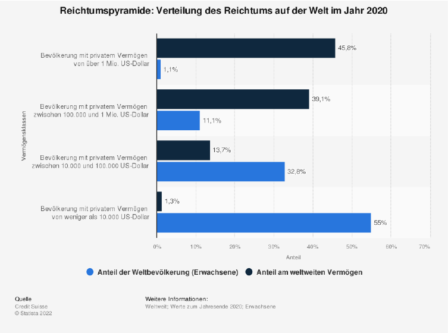
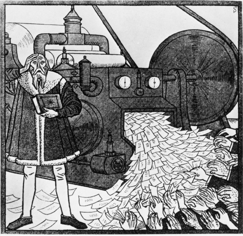
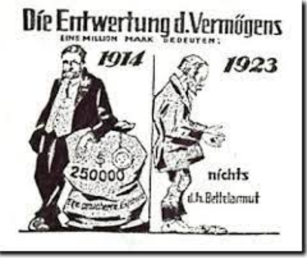

### 4.1 Was ist die Matrix?

Nun, in unserem Fall ist die Matrix eine Analogie zu unserer, von Menschen geschaffenen Welt, in der Sie sich zur aktuellen Blockzeit befinden. Zitate des Filmes dienen als Metapher, um Ihnen die Analogie vor Augen zu führen. Matrix ist ein Film aus dem Jahre 1999, den Sie nach diesem Buch vielleicht mit anderen Augen sehen werden.

Es ist eine unter den Bitcoinern weit verbreitete Analogie, spielt aber keine Rolle für Bitcoin. Ich könnte ebenso Fightclub, Nr.5 lebt, oder Free Willy wählen.

Die Matrix, unsere Welt, unser Alltag wird geformt und bestimmt durch den Menschen. SIE allein
entscheidet über Moral, Verhaltensweisen, Kultur, Gesetze, Konsum, Konsequenzen.

Am 15.08 1971 entschied sich wieder der Mensch, welche Konsequenzen auf uns jetzt gerade wirken
und noch welche Konsequenzen für Generationen ihrer Nachkommen gelten werden einem Fiat Standard.

Schuld ist die Regierung und ihre unendliche Geldschöpfung, die immer neue Vermögenswerte schafft. Ihre Zentralbanken oder Drucker von Peter Praet, Chefsvolkswirt der EZB liebevoll gennant, und Geschäftsbanken weiten ihre Finanzprodukte aufgrund ihrer Misswirtschaft immer weiter aus. Kaufen diese sogar selbst, um eine Korrektur zu verhindern. Sogar Krypto wird gekauft. Koste es was es wolle.

Die Gier des Menschen und der Bruch mit „Bretton Woods“ ließ das Virus „MMT“ um die ganze Welt
gehen. Es suggeriert schnellen Wohlstand für alle und ewiges Wachstum. Was für ein Traum.

Die Realität sieht leider etwas anders aus. Werfen wir doch einen Blich auf die Vermögensaufteilung des jetzigen Geldes.

Die Statistik zeigt die Verteilung des Reichtums auf der Welt zum Ende des Jahres 2020. Ende des Jahres besaßen 1,1% der Weltbevölkerung 45,8% des weltweiten Vermögens, Cantillonäre. Etwa rund 55% der Weltbevölkerung besaßen hingegen lediglich 1,3% des weltweiten Vermögens. 

Unser jetziges Geld ist also folglich auch nicht besser verteilt als Bitcoin. Aber wer gibt schon gerne seine Vorherrschaft auf, wenn es eine doch mit so viel besser geht.

Worin liegt denn der wahre Mehrwert für die Gesellschaft in Optionshandel, NFT´s usw. Alles nur imaginäre Konstrukte von Waren oder Ressourcen, die uns mehr Schaden als Nutzen bringen.

> „If Socialist understod economics, the wouldn`t be Socialists“.
> 
> *Friedrich August von Hayek*

Ein Eigenheim, Strom, Gas und Nahrungsmittel, -im Jahre 2022 Luxus. Ihre TV-Ökonomen in den öffentlich rechtlichen Medien, alles was Sie 2020 und auch schon immer sagten - einfach falsch.

Wie oft wurde schon aus „vorübergehend“ dauerhaft? Wir leben in absolut wilden, verrückten Zeiten, es wird mega spannend was auf uns zu kommt. Doch es wird uns immer als schlimmste Krise verkauft. Eine, wo der Staat/Regierung umgehend eingreifen muss.

Warum? Warum dürfen wir nicht als Gesellschaft daran wachsen und genesen aus uns heraus? Einigkeit, Recht und Freiheit? Wir haben kein Problem mit Helikopter-Eltern sondern mit Helikopter-Politikern und Helikopter-Geld, was Sie verteilen.

Geld für alle, Brot und Spiele. Aber wehe du solltest ein Julian Assange sein. Hüte dich, wehe du sprichst die Wahrheit aus. Sie war schon immer gefährlich für Regierungen und ihren Systemen.

Die Menschen verlieren das Vertrauen in Staat und Geld. Konflikte nehmen weltweit rasant zu, überall dasselbe Bild: Menschen stehlen oder verhungern, weil selbst die Tafel einen Annahmestop haben und unserer Regierung ist das egal. Denn die Tafel lebt nur von Spenden. PRIVATEN SPENDEN und EHRENAMTLICHEN Mitarbeitern, die wirklich tolle Arbeit leisten, für die keiner auf den Balkon
klatschen geht ;)

Die Umwelt wird zerstört, im Namen der Gier und des Profits, welches sich damit machen lässt. Ein Ökosiegel drauf, selber entworfen und es gibt noch mehr Profit. Wahnsinn oder?

Das ist das Hamsterrad, indem sich so viele befinden. Die andauernde Suche nach etwas. Der Grund, warum du nachts nicht einschlafen kannst vor lauter Fragen oder Sorgen.

Alles, was durch das Virus „MMT“ (ModernMoneyTheory) entstanden ist, ist die „MATRIX“. Regierungen sind symbiotisch mit MMT eine Perversion.

Es liegt nicht an uns, dass wir als immer wertloser erachtet werden. Es ist die Regierung, die uns nicht achtet, die Sie bestiehlt und belügt, opfert ohne Skrupel. Überlegen Sie immer zweimal, wem Sie vertrauen. Nicht jeder Mensch will Ihnen nur Gutes. 

Hier zwei Beispiele:
-Politiker
-Zentralbänker

Ich traue sicher beiden nicht, den Erschaffern unserer Matrix. Sie sind für Bitcoiner das Böse, die Wurzel allen
Übels, der Erzfeind.

