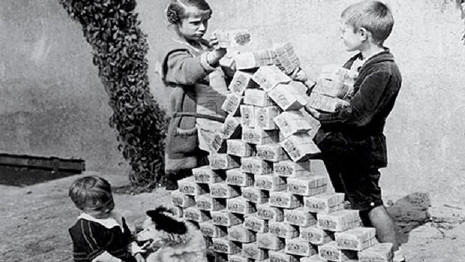

## 4.4. DER CANTILLON-EFFEKT

Als Cantillon-Effekt wird in der Ökonomie der Effekt bezeichnet, dass sich eine Erhöhung der (Giral-) Geldmenge (Nettokreditvergabe) nicht automatisch gleichmäßig auf alle Bereiche einer Volkswirtschaft verteilt, sondern in Stufen, wobei manche Bereiche (insbesondere der Bankensektor, andere staatliche Firmen, der Unternehmersektor und politisch begünstigte Gruppen) zuerst profitieren, während der Rest der Volkswirtschaft später folgt oder gar nicht von der Geldschöpfung profitiert.

Verlierer im Prozess der Geldschöpfung sind diejenigen, bei denen das Geld gar nicht landet, die aber dennoch wegen der Kreditschöpfungsbedingten Inflation gestiegene Preise zahlen müssen.

Benannt wurde der Effekt nach Richard Cantillon, der 1755 erstmals diesen Effekt in seiner „Abhandlung über die Natur des Handels im allgemeinen“ beschreibt, 

*Quelle: [Wikipedia](https://de.wikipedia.org/wiki/Cantillon-Effekt)*

[Wikipedia Hyperinflation 1923](https://commons.wikimedia.org/wiki/File:Hyperinflation_in_Germany_in_1923.jpg )

> Wer will ein fleißige Handwerker seh´n? 
> Der muss zu uns Kindern geh´n. 
> Stein auf Stein, Stein auf Stein. 
> Das Häuschen wird bald fertig sein. 
> Stein auf Stein, Stein auf Stein. 
> Das Häuschen wird bald fertig sein. 
> 
> *Kinderlied: Urheber und Zeit unbekannt.*
