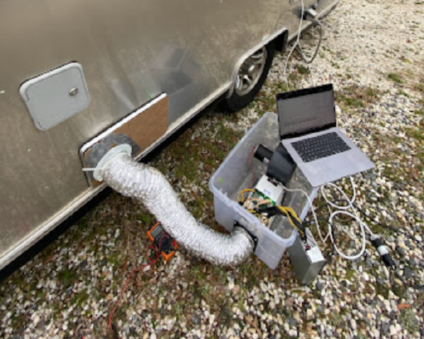
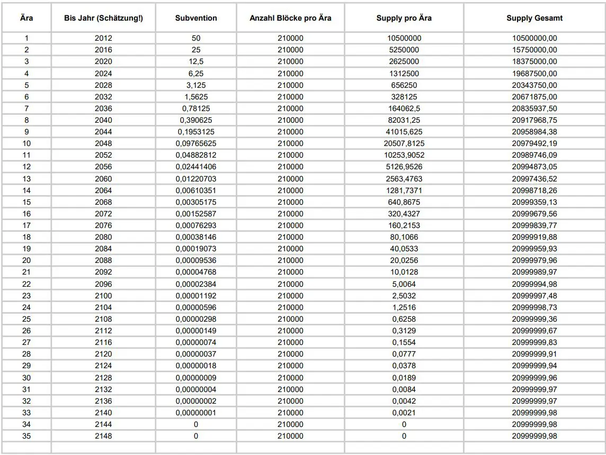
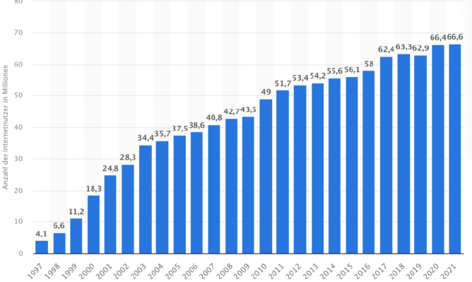
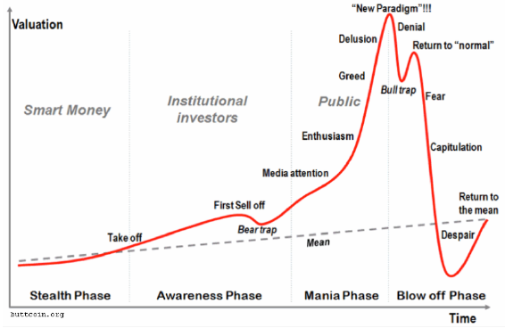

## 5.1. BITCOIN

**Peer-to-Peer (P2P) Electronic Cash-System**

**Erfinder: Satoshi Nakamoto**

**Online seit: 03.01.2009**

**Maximale Versorgung: 20.999.999.97690000**

  

Bitcoin ist die erste und weltweit am Markt stärkste „Kryptowährung“ auf Grundlage eines dezentral organisierten Buchungssystems.

Zahlungen, werden kryptographisch legitimiert (digitale Signatur) und über ein Rechennetz gleichberechtigter Computer abgewickelt.

*Quelle: [Wikipedia](https://de.wikipedia.org/wiki/Bitcoin)*

> „There is no second best“!
> 
> *Michael Saylor*

#### 92,5% der Bitcoin werden 2022 gemined sein.

#### 95 % der Bitcoin werden 2026 gemined sein.

#### 99% der Bitcoin werden 2035 gemined sein.

#### 99,9% der Bitcoin werden 2048 gemined sein.

#### 100% der Bitcoin werden 2140 gemined sein.

### Bitcoin ist teilbar

1 Satoshi (UTXO) benannt nach dem Erfinder des „White Paper“ und Bitcoin.

1 Satoshi = 0,00000001 Bitcoin
10 Satoshi = 0,0000001 Bitcoin
100 Satoshi = 0,000001 Bitcoin
1000 Satoshi = 0,00001 Bitcoin
10.000 Satoshi = 0,0001 Bitcoin
100.000 Satoshi = 0,001 Bitcoin
1.000.000 Satoshi = 0,01 Bitcoin
10.000.000 Satoshi = 0,1 Bitcoin
100.000.000 Satoshi = 1 Bitcoin

Bitcoins belohnt die Miner, die das Finden der neuen Blöcke übernehmen mit Bitcoin / UTXO / Satoshis / Sats.

Sie sind in ihrer Menge begrenzt für immer. 21 Millionen Stück, nicht reproduzierbar, in seiner Art einzigartig und nicht zu kopieren. Ein wirkliches Meisterwerk in jeglicher Hinsicht.

Sie verhalten sich wie Geld, wenn wir es als dieses anerkennen, unser Vertrauen aussprechen und es als dieses auch nutzen.

Bitcoin ist der erste Versuch eines dezentralen Geldes, von den Menschen für den Menschen, es soll uns dienen.

Bei einer Population von 7,7 Milliarden Menschen. die auf 21 Millionen
Einheiten treffen, könnte man Bitcoin fair untereinander zu wie folgt
aufteilen: **0,00270000 Bitcoin pro Mensch**

### Bitcoin ist ein Protokoll ein Finanz- oder Zahlungssysteme

Die Node das Kassenbuch. 

Die Coins/Sats/UTXOs sind das Geld. 

Die Miner, die Würfelspieler oder Bergbauer, die den Rohstoff bergen. Sie betreiben das System. 

Ihr Konto ist die Wallet. 

Der Public Key die IBAN. 

Der Private key ihre PIN.

> „Die Gesamtauflage wird 21.000.000 Coins betragen. Es wird verteilt werden an Netzwerkknoten (Anm. auch Nodes genannt), wenn sie Blöcke bilden, wobei der Betrag alle vier Jahre halbiert wird. Alle 4 Jahre. 
> 
> Die ersten 4 Jahre 10,500,000 Coins, die nächsten 4 Jahre 5.250.00 Coins, nächsten 4 Jahre 2.625.000 Coins, die nächsten 4 Jahre 1.312.500 Coins usw…
> 
> Wenn das ausläuft, kann das System Transaktionsgebühren unterstützen, falls benötigt. Es basiert auf einem Wettbewerb und es wird wahrscheinlich immer Nodes geben, die Transaktionen kostenlos verarbeite“.
>
> *Satoshi Nakamoto 08.01.2009*

> „Meine Wahl für die Anzahl der Coins und den Verteilungsplan basiert auf einer Schätzung. Es war eine schwierige Entscheidung, wenn das Netzwerk erst einmal läuft, ist es festgelegt und wir müssen uns damit ab finden.
> 
> Ich wollte etwas auswählen, bei dem die Kurse ähnlich wie bei bestehenden Währungen sind, aber ohne die Zukunft zu kennen, ist das sehr schwer“.
> 
> *Satoshi Nakamoto an Mike Hearn 12.04.2009*

> „Wenn du dir vorstellst, dass (Bitcoin) nur für ein Bruchteil des Welthandels verwendet wird, dann wird es nur 21 Millionen Coins für die ganze Welt geben, also wäre eine Einheit viel mehr wert.
> 
> Die Werte sind 64-Bit-Integer mit 8 Dezimalstellen, daher wird 1 Coin intern als 100.000.000 dargestellt.
> 
> Es gibt viel Granularität, wenn typische Kurse klein werden. Wenn zum Beispiel 0,001 (Bitcoin) 1 Euro wert ist, könnte es einfacherer sein, die Position des Dezimalpunktes zu ändern“.
> 
> *Satoshi Nakamoto an Mike Hearn 12.04.2009*

*Quelle: [@blocktrainer.de](https://www.blocktrainer.de/wissen/warum-21-millionen-bitcoin/)*

Bitcoin verhält sich wie ein Virus. Sie in infizieren sich ganz unbewusst oder bewusst. Der Kontakt ist unausweichlich, Sie haben darauf
keinen Einfluss. Es ist der Schmetterlingseffekt der Sie hier hin
geführt hat. Es ist das „Bellerophon“ gegen das Virus Fiat „Chimera“.
Es soll uns zurück zum Gleichgewicht mit der Natur und uns selbst bringen. 

Unser Retter, unser Feind, das Virus, befällt immer
zuerst die schwachen der Gesellschaft, die alten, die
Behinderten, junge und kranke Menschen.

**Gutes Geld wird immer schlechtes Geld verdrängen und die Gier der Menschen lässt dieses Wechselspiel bis zum heutigen Tage zirkulieren, da wir nie Geld und Staat getrennt haben.**

Bitcoin ist ein „schwarzes Loch“ und ebenso ein „weißes Loch“. Bitcoin ist eine Vision, ein Rohstoff von begrenzter Einheit. Das erste digitale Element, erschaffen durch den Menschen, um Ihn zu erlösen, eine Waffe.

Es ist die wohl mächtigste, jemals von Menschenhand erschaffene Waffe nach der Atombombe. So revolutionär wie das Internet und die daraus entstanden Konsequenzen für unseren Alltag.

Eine Waffe gegen das vorherrschende System der Matrix und wir sind im Krieg, gegen jenes was Sie beraubt, belügt und betrügt.

Bitcoiner sind nicht abhängige einer PONZI-Blockchainsekte, wir sind Frauen, Männer, Kinder, Soldaten, Visionäre, die zum Wohle der
Allgemeinheit handeln. Wir sind libertär.

Jede revolutionäre Erfindung, war fremd, neuartig oder angsteinflößend. Das Auto, Strom, Internet, Handys usw. Wollen Sie etwa auf diesen Fortschritt verzichten?

Aber ihr Nutzen wurde erkannt und sie hatte daraufhin ein exponentielles Wachstum, die Massenadaption fand statt.

An einem gewissen Punkt lässt sich exponentielles Wachstum in der Anfangsphase immer als „Blase“ abtun, da der Chart einen ähnlichen Verlauf aufweist. Sollte jedoch der Nutzen vom einzelnen oder vielen unterschätzt werden, wird das Wachstum anhand des offen dargestellten Nutzen weiterhin ansteigen und trotzdem nicht aufhören .

Die Erkenntnis von den Vorteilen eines gedeckten unabhängigen Geldes vereint also all die Menschen, die sich für Bitcoin begeistern können.

Daher wirkt es für Außenstehende, aufgrund ihres Unwissens und der Tatsache, dass Sie die Symbiose der Einigkeit noch nicht erfahren haben, wie eine Sekte oder eine Religion.

Wem vertrauen Sie?

Ich einem gedecktem, transparentem, freiem, limitierten Geld und dem Code.

>  „Have fun staying poor“.
>
> *Michael Saylor* 
> *Quelle: [r/Buttcoin: The Classic Bitcoiner Response](https://www.reddit.com/r/Buttcoin/comments/vcris6/the_classic_bitcoiner_response_have_fun_staying/)*

> „Es gibt zwei Möglichkeiten aus dem Gebäude zu kommen, über das Gerüst, oder in Handschellen.
>
> Beide sind riskant. Die Wahl überlasse ich dir“.
> 
> *Morpheus @Matrix*
