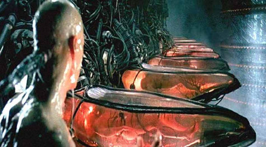
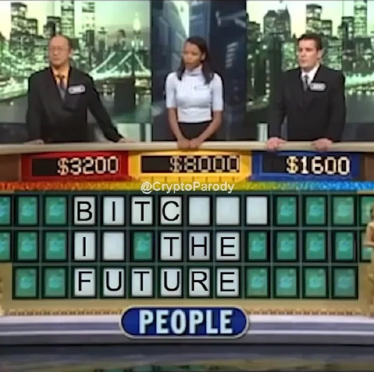

## 5.3. Fazit

> Denn ich bin ganz nah dran. 
> Bin ganz nah dran. 
> Alle denken nur noch ich bin Irre. 
> Ist mir egal.. 
>
> Oft war ich verzweifelt, doch das ist vergangen. 
> Nichts und niemand hält mich jetzt noch auf. 
> Denn ich bin ganz nah dran. 
> 
> Ich weiß noch mein Vater sagte 
> „manchmal werden Märchen wahr“. 
> Es liegt in deiner Hand. 
> Nur du machst es klar. 
> 
> *Auszug: Songtext, Ganz nah dran* 
> *Songwriter: Randy Newman/ Heike Kospach* 
> *@ Küss den Frosch Walt Disney Music Company*

Die Regeln von Bitcoin sind klar definiert und unveränderbar.

Es gibt 21.000.000 Millionen „Bitcoins“. Bitcoin sind Buchstaben und Zahlen in einer Kette von Blöcken, eine Konstante zur Zeit.

Die Politik, der Staat und Ihr Finanzsystem eher ein Wechselspiel der Gefühle.

Bitcoin gibt Ihnen die Eigenverantwortung zurück, Sie selbst sind die Bank.

Sie verkonsumieren nur das, was Sie wirklich benötigen, entziehen sich der modernen Wegwerfgesellschaft von heute.

Fiat Währungen schaffen immer nur neue unnötige Vermögenswerte, die uns blenden sollen.

In einer Welt von Sondervermögen, Übergewinne oder Zufallsgewinne durch Fiat Geld kann man niemanden mehr vertrauen, niemand ist sich seiner
Zeit und Geldes sicher.

Sie müssen die Dinge nicht zwingend verstehen, um diese nutzen oder davon profitieren zu können.

Bitcoin ist nur Versuch. Wir wissen nicht, wem die Allgemeinheit das
Vertrauen ausspricht. Wir wissen nicht, ob morgen ein elektromagnetischer Impuls durch die Sonne stattfindet und wir alle wieder im Mittelalter leben, was für niemanden von uns, wirklich erfreulich wäre.

*Bitcoin fixes this* bedeutet ein gedecktes, globales, dezentrales, limitiertes Geld ohne dritte Instanz. Es bedeutet, dass egal wie schlimm es doch sein mag, worin die Lösung besteht, Bitcoin.

Es ist Bitcoin egal, wo du bist, welche ethnische Herkunft, welches Aussehen, welche Meinungen, Vorlieben oder Eigenschaften du auch immer hast.

Es ist da, um zu dienen. Es ist da, um das Vertrauen ins Geld zurück zu geben.

Bitcoin ist so viel mehr, als wir jemals hatten. Es ist die Hoffnung auf eine bessere Zukunft für unsere Kinder, in der Ressourcen nicht verschenkt oder verschwendet werden.

Es ist eine alternative zum jetzigen bestehenden System.

Angriffe auf das Netzwerk sind so gut wie unmöglich. Es regeneriert sich wie ein Axolotl, verbreitet sich unaufhaltsam wie ein Virus in den
Köpfen der Menschen, wächst heran zu einem physischen und psychischen Netzwerk mit dem Potential zur Heilung der Welt in der wir, auf der wir
leben dürfen.

Wir genesen an Bitcoin, wir wachsen mit Bitcoin.

Ich bin gewachsen an Bitcoin, meine Familie, meine Freunde und mein Kind wird es.

Ich glaube wieder an den Menschen, ich glaube an das gute in ihm, an seine Vernunft und die Fähigkeit an Krisen zu wachsen. Egal ob er diese nun zuvor selbstverursacht hat oder nicht. Die Verneigung kann eine Art von Unterdrückung sein  oder auch die des Respekts.

Ich verneige mich voller Demut, Dankbarkeit und Respekt vor Satoshi Nakamoto, vor Bitcoin, dem Netzwerk.

Als ich nach Jahren der Gefangenschaft endlich frei
war, es begriff und wirklich realisierte, brachte Bitcoin mich
zum Weinen. Es berührte meine Seele.

Das wer einer der intensivsten Reisen, die Ich jemals gemacht haben darf, einer der wohl wirklich prägenden Moment im Leben.

Bitcoin macht Sie reich, das ist richtig, aber ganz anders wie es sich dich meisten Vorstellen. Spoiler es hat nichts mit Geld zu tun.

> „Solange die Matrix existiert, wird der Mensch niemals frei sein“.
> 
> *Morpheus @Matrix*
