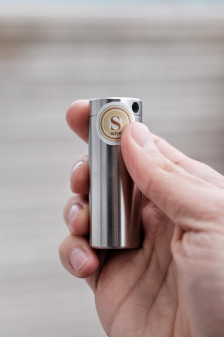
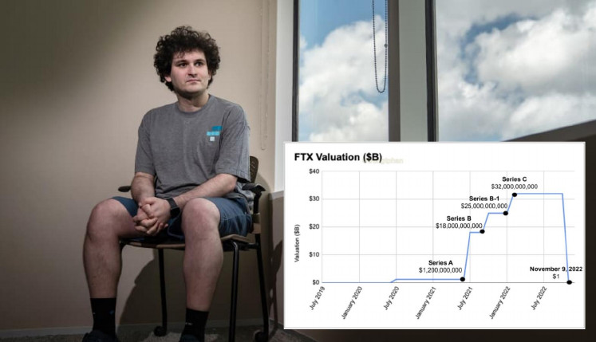

## 6.1. WALLET

Sind nicht Sie im Besitz Ihrer Bitcoin, sondern eine 2. Instanz, wie zum Beispiel eine Exchange, Börse, haben nicht Sie selbst den Zugriff auf diese und damit die Verantwortlichkeit?

#### Not your Keys, Not your Coins.

#### Nicht Deine Schlüssel, nicht Deine Münzen.

Sie brauchen ein eigene Wallet!!!!

Es gibt zahlreiche unterschiedliche Arten von Wallets: Web-Wallets, Mobile- oder Desktop-Wallets sowie Hardware-und Papier-Wallets.

Zum Beispiel: Exchange Wallet, Lightning Wallet, Cold Wallet

Ich rate Ihnen immer zu einer Hardware Wallet und einem Backup aus Stahl, aus Gründen der Sicherheit.

Wer schleppt denn schon gerne all seine Ersparnisse mit sich herum? Wenn Sie mit dem Gedanken spielen, Bitcoin zu erwerben, müssen sich auch bewusst sein, dass damit die Verantwortung eingehen wird, diese selbständig zu verwalten. Sei es für sich selbst oder für jemanden anderen. Denken Sie auch daran, wie Sie Ihre Bitcoin sicher vererben können, ohne einer 3. Instanz oder ohne Steuer, die Raub Ihrer Zeit und
physikalischer Leistung ist.

Als Hardware Wallet empfiehlt sich meiner persönlichen Meinung nach die BitBox02 Bitcoin only Edition von [Shift Crypto](https://bitbox.swiss/).

Mit dieser stellen Sie Ihren individuellen Schlüssel her, die Wörter sind der Schlüssel. Diese müssen Sie beschützen. Wer diese hat, hat den uneingeschränkten Zugri auf dem ihn zugeschrieben Bestand an UTXO‘s.

Aber selbst so kann diese Art der Verwahrung als solches noch nicht als wirklich sicher bezeichnet werden. Sie haben lediglich den Zugriff sichergestellt und verwahren jetzt eigenmächtig.

Hacker haben, solange der Schlüssel nicht ausgeplaudert oder verbreitet wird, keine Möglichkeit an ihren Bestand zum kommen.

Mt.Gox, Celsius, FTX, Nuri und Co. können Ihnen egal sein. Sie schlafen dennoch gut. Was fehlt ist der Schutz vor anderen Katastrophen, wie z.B Feuer. Was ist wenn das Haus samt BitBox02 komplett in Flammen steht? Das Backup, der Wörter auf Papier sind dann eine Spende an das ganze Netzwerk. Danke..., oder?

Ich mache hier nochmal unbezahlte Werbung, was ich nochmals betonen möchte und empfehle ein Stahl Backup von [seedor.io](https://www.seedor.io/) Made in Germany, welches meiner persönlichen Meinung nach sein Geld wert und ideal für Einsteiger geeignet ist. Ich habe schon Erfahrungen mit einem Hausbrand machen dürfen. Glauben Sie mir, damit ist es entspannter und Sie auf der sicheren Seite. Ihre Wörter gestanzt in Stahl.

Verleihen Sie kein Geld, um mehr zu generieren. Sparen Sie ehrlich. Ansonsten sollten Sie bereit sein, alles zu verlieren. Es gibt keine Alternative. Seien Sie produktiv, nichts im Leben ist umsonst, alles ist ein stetiger Austausch von Proof of work. Schaffen Sie Mehrwert.

